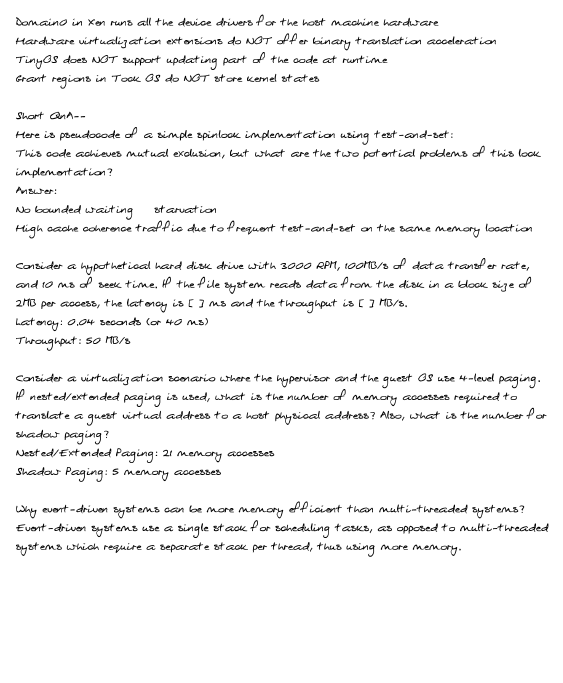

# ✍️ Text2Pen

A modern, customizable tool to convert your typed text into realistic handwriting on A4 paper.  
Supports multi-column layouts, handwriting font selection, background customization, color, jitter, and more—all with a clean Gradio web UI.

---

## 🚀 Features

- **Modern Gradio Web UI**: Easy-to-use, clean, and responsive.
- **Direct Text Input or File Upload**: Paste text or upload `.txt` files.
- **Handwriting Fonts**: Choose from built-in fonts or upload your own `.ttf`.
- **Backgrounds**: Use blank, ruled, or custom backgrounds.
- **Multi-Column Layout**: Split your page into 1, 2, or 3 columns.
- **Customizable**: Font size, line spacing, margin, color, jitter, and more.
- **Preview & Download**: Preview pages as images, download as PDF (generated on demand).
- **A4 Output**: Perfect for cheat sheets, study notes, or printing.

---

## 📸 Screenshots

### Main UI


### Customization Tab


### Example Output



### Multi Column Layout


---

## 🛠️ Installation

1. **Clone the repository:**
   ```sh
   git clone https://github.com/yourusername/Text2Pen.git
   cd Text2Pen
   ```

2. **Install dependencies:**
   ```sh
   pip install -r requirements.txt
   ```
   *Requirements: `gradio`, `pillow`*

3. **(Optional) Add Fonts/Backgrounds:**
   - Place `.ttf` fonts in the `fonts/` folder.
   - Place background images in the `backgrounds/` folder.

---

## 🏃 Usage

### Start the App

```sh
python main.py
```

- The Gradio UI will open in your browser.
- Enter or upload your text, customize options, and generate handwriting.

### Output

- **Preview**: See generated pages as images.
- **Download PDF**: Click "Generate & Download PDF" to get a PDF (temporary file, not saved).

---

## 📂 Project Structure

```
Text2Pen/
│
├── main.py
├── README.md
├── requirements.txt
├── fonts/
│   ├── QEJulianDean.ttf
│   └── QEKevinKnowles.ttf
├── backgrounds/
│   └── ruled_a4.png
├── generated/
│   ├── images/
│   └── pdfs/
├── sample_ui_1.png
├── sample_ui_2.png
└── sample_output_page.png
```

---

## ✏️ Customization

- **Fonts**: Add your own `.ttf` files to the `fonts/` folder or upload via the UI.
- **Backgrounds**: Add PNG/JPG backgrounds to the `backgrounds/` folder or upload via the UI.
- **Advanced Options**: Adjust font size, line spacing, margin, jitter, columns, and color in the Customization tab.

---

## 📝 Notes

- PDF files are generated as temporary files and are not stored permanently.
- Images are saved in `generated/images/` for preview purposes.
- For best results, use high-quality handwriting fonts and A4-sized backgrounds.

---

## 📄 License

Apache License 2.0

---

## 🙏 Credits

- [Gradio](https://gradio.app/)
- [Pillow](https://python-pillow.org/)
- Handwriting fonts from [Google Fonts](https://fonts.google.com/) and [DaFont](https://www.dafont.com/)

---

## 💡 Example Use Cases

- Micro cheat sheets for exams
- Study notes that look handwritten
- Generating realistic handwritten letters
- Printing custom notes for planners or journals

---

## 🤝 Contributing

Pull requests and suggestions are welcome!

---

## 📧 Contact

For questions or feedback, open an issue or contact [subhashbs36@gmail.com](mailto:subhashbs36@gmail.com).
